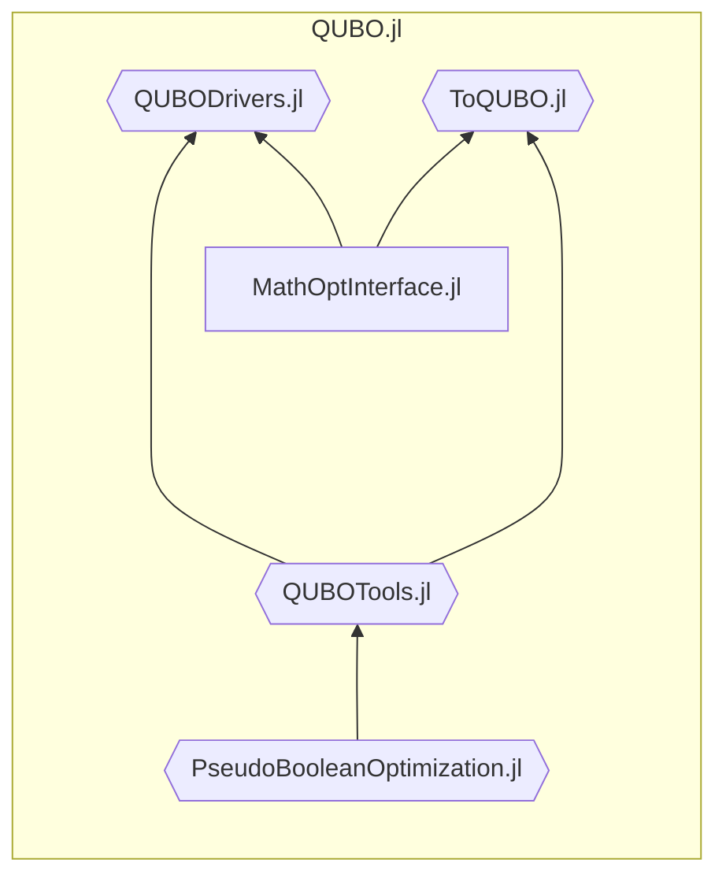

# Design

```mermaid
flowchart LR;
    subgraph QUBO ["QUBO.jl"];
        direction BT;
        PBO{{PseudoBooleanOptimization.jl}};
        MOI["MathOptInterface.jl"];
        QT{{QUBOTools.jl}};
        QD{{QUBODrivers.jl}};
        TQ{{ToQUBO.jl}};

        PBO --> QT;
        MOI --> QD;
        QT ----> QD;
        QT ----> TQ;
        MOI --> TQ;
    end
```
